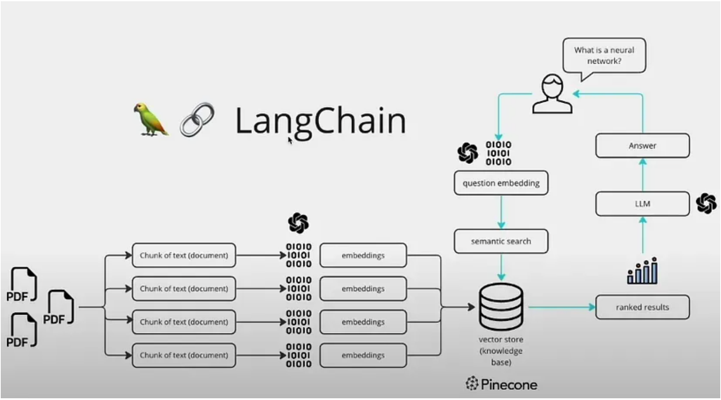

# My Data Agent

## 프로젝트 구조

- LangChain 기반의 RAG Agent 를 Fast API 기반의 RESTful API 서버로 구현한 프로젝트입니다.
- 전체 구조는 아래 LangChain의 구조를 참고하여 구현되었습니다.

* 출처: LangChain


## project setting 방법
```

1. 가상환경 생성

    $ ./scripts/venv.create.sh

2. interpreter 설정

3. 필수 환경 변수 파일 (.env) 생성
    
    my_data_backend 디렉토리에 .env 파일 생성 후 아래 필수 필드 추가
    
        COHERE_API_KEY=your_cohere_api_key
        OPENAI_API_KEY=your_openai_api_key
        KMP_DUPLICATE_LIB_OK=TRUE
        TOKENIZERS_PARALLELISM=false
   
4. 루트 디렉토리의 run_my_data_backend.py 실행

    $ python run_my_data_backend.py

```

## 참고 사항
- vector store 는 로컬에 저장되어 있으며
  - mydata_backend/vector_store
- 이 후 Pinecone으로 저장소 이전 시 config 에서 환경 변수를 변경하면 됩니다.
    - USE_PINECONE = True
    - PINECONE_ 관련 변수들 설정 필요
- 현재 vector store는 
  - cohere의 embed-multilingual-v3.0 모델과
  - CLIP (openai/clip-vit-base-patch16) 모델로
  - 이원화하여 관리중입니다.
    - 사용자의 텍스트 쿼리는 cohere의 embed-multilingual-v3.0 모델을 기반으로 document retrieval을 수행하며,
    - 사용자의 이미지 쿼리는 CLIP 모델을 기반으로 document retrieval을 수행합니다.
- llm 모델은 gpt-4o-mini 모델을 사용중이며, config에서 환경변수로 관리중입니다.
